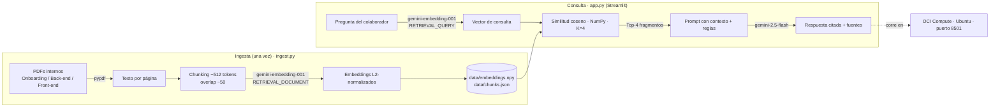

# Challenge-Alura-Agente
Proyecto de despliegue de Chatbot para consulta interna de la empresa Pegasus.

# 📚 Asistente Interno de Santo Pegasus Soluciones (RAG)

Agente de **Retrieval-Augmented Generation (RAG)** que responde, en lenguaje
natural, preguntas de las personas colaboradoras sobre la documentación interna de
Santo Pegasus Soluciones —**Manual de Onboarding**, **Guía de Ingeniería Back-end**
y **Guía de Ingeniería Front-end**— citando el documento y la página de cada dato.

Proyecto final **Alura Agente** (ONE / Oracle Next Education). Desplegado en
**Oracle Cloud Infrastructure (OCI) Compute**.

> 🔗 **App en vivo (OCI):** `http://<TU_IP_PUBLICA>:8501`
> 🖼️ Captura del despliegue: ver [`docs_img/oci_running.png`](docs_img/oci_running.png)

---

## 🎯 Problema

Las personas colaboradoras pierden tiempo buscando información dispersa en manuales
y guías internas (¿cuántas aprobaciones necesita un PR? ¿qué versión de Java usamos?
¿a qué canales de Slack me uno el día 1?). Este agente permite preguntar en lenguaje
natural y obtener una respuesta **fundamentada y con la fuente citada**, sin abrir
ningún documento. Si el dato no está en la documentación, lo dice en lugar de inventar.

---

## 🏗️ Arquitectura



**Decisión de diseño:** stack deliberadamente liviano (solo `numpy` para la búsqueda,
sin FAISS ni modelos locales) para que el contenedor sea fácil de desplegar y quepa
holgado en una VM Always Free de OCI. El LLM y los embeddings son servicios externos
(Gemini), consumidos por la app que corre en OCI —el mismo patrón que la Guía Back-end
describe como *"integración con LLMs externos"*.

> El desafío sugiere LangChain + PyPDF; usamos PyPDF y una orquestación propia en
> lugar de LangChain. El brief permite explícitamente elegir las herramientas que
> uno conoce mejor, priorizando que **la solución funcione**.

### Alineación con el estándar RAG interno (Guía Back-end, Sección 5.1)

| Regla interna | En este proyecto |
|---|---|
| Chunks de 512 tokens, overlap 50 | ~1600 chars ≈ 512 tokens, overlap 200 ≈ 50 |
| Recuperación K = 4 | `TOP_K = 4` |
| FAISS solo para pruebas locales | Búsqueda coseno en memoria (equivalente a un índice *flat* a esta escala) |
| Modelo de embeddings homologado: `text-embedding-004` | ⚠️ Google lo deprecó el 14-ene-2026 → usamos su sucesor `gemini-embedding-001` |

---

## 🧰 Stack

| Componente | Tecnología |
|---|---|
| Lenguaje | Python 3.10+ |
| Interfaz | Streamlit (chat) |
| LLM | `gemini-2.5-flash` (free tier) |
| Embeddings | `gemini-embedding-001` (free tier) |
| Extracción PDF | pypdf |
| Búsqueda vectorial | NumPy (coseno) |
| Despliegue | **OCI Compute** (VM Always Free, Ubuntu 22.04) |

---

## 📂 Estructura

```
rag-agente-santo-pegasus/
├── app.py                    # Agente RAG (Streamlit)
├── ingest.py                 # Ingesta: PDFs → embeddings → data/
├── requirements.txt
├── README.md
├── .gitignore
├── .streamlit/
│   ├── config.toml           # Tema (colores de marca de la empresa)
│   └── secrets.toml.example  # Plantilla API key (local/Streamlit Cloud)
├── deploy/
│   ├── setup_oci.sh          # Bootstrap de la VM de OCI
│   └── rag-pegasus.service   # Servicio systemd (app 24/7)
├── docs/                     # PDFs internos de muestra
│   ├── Manual_Onboarding.pdf
│   ├── Guia_Backend.pdf
│   └── Guia_Frontend.pdf
├── docs_img/                 # Capturas (incluir la de OCI corriendo)
└── data/                     # Índice generado por ingest.py
```

---

## 🚀 Ejecutar en local

```bash
git clone https://github.com/<tu-usuario>/rag-agente-santo-pegasus.git
cd rag-agente-santo-pegasus
pip install -r requirements.txt

# 1) Índice
export GEMINI_API_KEY="tu_api_key"          # PowerShell: $env:GEMINI_API_KEY="..."
python ingest.py

# 2) App
cp .streamlit/secrets.toml.example .streamlit/secrets.toml   # y pegá tu key
streamlit run app.py
```

Abre en `http://localhost:8501`. API key gratuita: https://aistudio.google.com/apikey

> 💡 También podés prototipar la ingesta en **Google Colab** (Python ya viene listo)
> antes de subir a OCI.

---

## ☁️ Despliegue en OCI Compute (paso a paso)

### 1. Crear la instancia
En la consola de OCI: **Compute → Instances → Create Instance**.
- **Image:** Canonical Ubuntu 22.04
- **Shape:** `VM.Standard.A1.Flex` (ARM Ampere, Always Free — hasta 2 OCPU / 12 GB)
  o `VM.Standard.E2.1.Micro` (AMD, Always Free)
- Agregá tu **SSH public key** y anotá la **IP pública** asignada.

### 2. Abrir el puerto 8501 en la Security List
**Networking → Virtual Cloud Networks → tu VCN → Security Lists → Default Security
List → Add Ingress Rules:**
- Source CIDR: `0.0.0.0/0` · IP Protocol: `TCP` · Destination Port Range: `8501`

### 3. Conectarse y preparar la VM
```bash
ssh ubuntu@<TU_IP_PUBLICA>
git clone https://github.com/<tu-usuario>/rag-agente-santo-pegasus.git
cd rag-agente-santo-pegasus
bash deploy/setup_oci.sh
```
`setup_oci.sh` instala dependencias, **abre el puerto 8501 en el firewall del SO
(iptables)** —OCI lo bloquea por defecto aunque esté abierto en la consola— y crea
el entorno virtual.

### 4. Índice y arranque
```bash
echo 'GEMINI_API_KEY=tu_api_key' > .env
set -a && source .env && set +a
python ingest.py
```

**Opción A — prueba rápida:**
```bash
source .venv/bin/activate
streamlit run app.py --server.address 0.0.0.0 --server.port 8501
```

**Opción B — 24/7 con systemd (recomendado para el entregable):**
```bash
sudo cp deploy/rag-pegasus.service /etc/systemd/system/
sudo systemctl daemon-reload
sudo systemctl enable --now rag-pegasus
sudo systemctl status rag-pegasus
```

### 5. Verificar
Abrí `http://<TU_IP_PUBLICA>:8501` en el navegador y **tomá la captura** para el
README (`docs_img/oci_running.png`).

> ⚠️ **Los dos errores más comunes en OCI:**
> 1. Abrir el puerto solo en la Security List y olvidar el **firewall del SO**
>    (iptables en Ubuntu). Hay que abrirlo en ambos lados.
> 2. Correr Streamlit sin `--server.address 0.0.0.0` (queda escuchando solo en
>    localhost y no responde desde afuera).

---

## 💬 Ejemplos de preguntas y respuestas

| Pregunta | Respuesta esperada (con cita) |
|---|---|
| ¿Cuántas aprobaciones necesita un PR para hacer merge? | Al menos **2 aprobaciones** de miembros Senior o Semi-Senior (Pleno). *(Guía Back-end, pág. 8; Manual de Onboarding, pág. 24)* |
| ¿Qué versión de Java y Spring Boot usamos en el back-end? | **Java 17+** y **Spring Boot 3+**. *(Guía Back-end, Sección 3)* |
| ¿Cuál es la cobertura mínima de pruebas obligatoria? | **80%** en pruebas unitarias, verificada en el Code Review / CI. *(ambas guías)* |
| ¿A qué canales de Slack me uno el primer día? | `#general`, `#back-end`, `#front-end`, `#devops`, `#incidents`, `#code-reviews`, `#aprendizaje`, `#random` y el canal del squad. *(Manual de Onboarding, Sección 3.4)* |
| ¿Qué modelo de embeddings define el estándar RAG interno? | `text-embedding-004`. *(Guía Back-end, Sección 5.1)* — Nota: deprecado por Google el 14-ene-2026. |
| ¿Puedo usar `System.out.println()` para debug? | No; está prohibido. Se usa SLF4J con Logback. *(Guía Back-end)* |

---

## 📝 Historial de commits sugerido

El proyecto sigue **Conventional Commits** (el mismo estándar que exige la
documentación interna de Santo Pegasus):

```bash
chore: estructura inicial del proyecto y requirements
feat(ingest): extracción de PDFs, chunking y embeddings con Gemini
feat(app): agente RAG con recuperación coseno y citación de fuentes
docs(company): agrega PDFs internos de Santo Pegasus e índice
feat(deploy): script de OCI y servicio systemd
docs: README con arquitectura, ejemplos y guía de despliegue en OCI
```

---

## 🔍 Cómo funciona (resumen)

1. **Ingesta:** cada PDF se extrae por página y se trocea en fragmentos (~512 tokens,
   overlap ~50). Cada fragmento se embebe con `gemini-embedding-001`
   (`RETRIEVAL_DOCUMENT`) y se normaliza (L2).
2. **Recuperación:** la pregunta se embebe (`RETRIEVAL_QUERY`) y se comparan vectores
   por coseno; se toman los **4** fragmentos más relevantes.
3. **Generación:** esos fragmentos van como CONTEXTO al prompt. `gemini-2.5-flash`
   responde **solo** con base en el contexto y **cita documento + página**.
4. **Transparencia:** la app muestra los fragmentos exactos que respaldan la respuesta.

El *system prompt* obliga a no inventar y a declarar cuándo la información no está en
el contexto.

---

## ⚖️ Notas

- Los PDFs de `docs/` son material de muestra (empresa ficticia) provisto por el
  desafío; se incluyen para reproducibilidad.
- La documentación interna homologa `text-embedding-004`; como Google lo deprecó,
  este proyecto usa el sucesor oficial `gemini-embedding-001`.

## 📄 Licencia

MIT.
